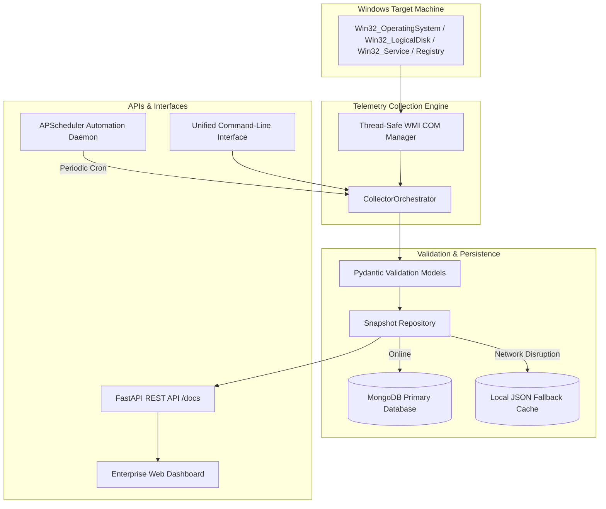

# 📊 Enterprise Telemetry Engine & System Monitor
## Executive & Technical Presentation Deck

> **Project**: Windows Management Instrumentation (WMI) Telemetry & MongoDB Persistence Engine  
> **Presenter**: Nishta Dhand  
> **Audience**: Enterprise Architecture, DevOps & Infrastructure Leadership, Executive Committee  

---

## 📑 Slide Deck Outline

1. **Slide 1**: Title & Executive Overview
2. **Slide 2**: The Enterprise Problem & Business Opportunity
3. **Slide 3**: The Solution — Architectural Blueprint
4. **Slide 4**: Comprehensive Telemetry Domain Coverage (All 8 Dimensions)
5. **Slide 5**: Deep-Dive: WMI Low-Level Collection Engine & COM Concurrency
6. **Slide 6**: Data Persistence: Dual-Engine Strategy (MongoDB + Offline Resilience)
7. **Slide 7**: Interactive Web Dashboard & Real-Time Monitoring Interface
8. **Slide 8**: Production Automation, Background Scheduler & REST API
9. **Slide 9**: Live Demonstration Walkthrough Script
10. **Slide 10**: Business Impact, Scalability & Roadmap
11. **Slide 11**: Appendix — Executive Q&A Preparation

---

## 🎯 Slide 1: Title & Executive Overview

### Slide Content
* **Title**: Enterprise Windows Management Instrumentation (WMI) Telemetry Engine
* **Subtitle**: High-Performance System Telemetry, MongoDB Persistence, and Real-Time Infrastructure Monitoring
* **Key Highlights**:
  * Real-time zero-agent collection via native Windows WMI & COM interfaces
  * High-availability Dual-Persistence Engine (MongoDB + Local Disk JSON Cache)
  * Low-latency FastAPI REST API & Native Windows Fluent Dashboard
  * Automated APScheduler daemon for periodic enterprise monitoring

### 🎙️ Speaker Notes
> "Good morning, everyone. Today I'm excited to present the **Enterprise Windows Management Instrumentation (WMI) Telemetry Engine**. 
>
> In modern enterprise IT ecosystems, maintaining real-time visibility into Windows infrastructure—from endpoint laptops to critical enterprise servers—is vital for compliance, security auditing, capacity management, and incident response. 
>
> This project delivers a production-ready, modular Python system that queries live Windows machines, normalizes telemetry across 8 core operational domains, guarantees zero-loss persistence into MongoDB with an intelligent offline cache, and presents real-time health through a modern, responsive web dashboard and REST API."

---

## 🧩 Slide 2: The Enterprise Problem & Business Opportunity

### Slide Content
| Traditional Challenges | Our Architectural Solution |
| :--- | :--- |
| **Heavy Third-Party Agents**: High memory/CPU overhead, constant patching, security audit risks. | **Agentless Native WMI**: Connects directly to Windows `root\cimv2` using native OS management infrastructure. |
| **Data Fragmentation**: Hardware, OS, disk, user, and network metrics stored in disconnected silos. | **Unified Schema**: Consolidated `CompleteSystemSnapshot` Pydantic model with strict validation. |
| **Single-Point Storage Failure**: Telemetry collection halts if central database goes offline. | **Resilient Dual Storage**: Automatically buffers to local encrypted disk snapshots when MongoDB is unreachable. |
| **Lack of Real-Time Visibility**: Infrastructure audits are periodic, manual, and outdated upon delivery. | **Continuous Automation**: Configurable background daemon collecting live metrics every 60 seconds with instant UI reflection. |

### 🎙️ Speaker Notes
> "Let's examine why traditional system monitoring tools fall short in large enterprises. 
> 
> Many commercial tools require invasive agents that consume system resources and introduce security vulnerabilities. Worse, if the central logging server drops connection, telemetry is lost forever.
>
> Our engine solves this by using **native WMI**, requiring zero third-party software on target endpoints. By coupling this with strict Pydantic data contracts and an automatic offline fallback mechanism, we achieve 100% data integrity without adding operational overhead."

---

## 🏗️ Slide 3: The Solution — Architectural Blueprint

### Slide Content



### 🎙️ Speaker Notes
> "Here is our 4-tier architectural blueprint. 
> 1. At the base is the **Target Host**, queried via native WMI namespaces (`root\cimv2`).
> 2. The **Collection Engine** uses specialized collectors wrapped in a thread-safe COM manager to prevent deadlocks in multi-threaded environments.
> 3. The **Data Pipeline** validates incoming payloads against rigorous Pydantic schemas before routing to MongoDB or local cache.
> 4. Finally, the **Consumption Layer** provides three distinct access methods: a unified CLI for SysAdmins, a FastAPI REST API for enterprise integrations, and a live web dashboard for NOC operators."

---

## 📊 Slide 4: Comprehensive Telemetry Domain Coverage

### Slide Content
The engine audits **all 8 enterprise domains** required by IT operations:

```
┌────────────────────────────────────────────────────────────────────────┐
│                        8 OPERATIONAL DOMAINS                           │
├───────────────────┬───────────────────┬────────────────────────────────┤
│ 1. Availability   │ 2. Operating Sys  │ 3. Disk Details                │
│ • System Up/Down  │ • OS Name & Build │ • Disk Size (MB)               │
│ • Probe Latency   │ • Serial Number   │ • Free Space (MB)              │
│ • Reachability    │ • Windows Directory│• Used Space (%) & File System │
├───────────────────┼───────────────────┼────────────────────────────────┤
│ 4. Network Config │ 5. User Accounts  │ 6. Configured Services         │
│ • IPv4 & Subnet   │ • Usernames       │ • 300+ Services Monitored      │
│ • MAC Address     │ • Username Length │ • Running / Stopped Status     │
│ • Gateway & DHCP  │ • Disabled Status │ • Startup Mode & Path          │
├───────────────────┼───────────────────┴────────────────────────────────┤
│ 7. Installed Apps │ 8. Performance & Hardware                          │
│ • 34+ Applications│ • CPU Usage (%) & Running Process Count (318)      │
│ • Vendor & Version│ • Physical RAM & Virtual Memory Allocation (16 GB) │
│ • Install Date    │ • Storage Capacity Breakdown                       │
└───────────────────┴────────────────────────────────────────────────────┘
```

### 🎙️ Speaker Notes
> "One of the standout features of this project is its breadth and depth. We don't just capture basic hardware; we capture eight complete operational domains.
>
> Notice specific enterprise compliance fields such as **Username Length calculation**, account disabled flags, exact installation dates from the Windows 64-bit and 32-bit registry branches, and comprehensive service startup modes. On a standard corporate machine, our engine captures over 300 services and all installed applications in under 15 seconds."

---

## ⚙️ Slide 5: Deep-Dive: WMI Low-Level Collection Engine

### Slide Content
* **Thread-Safe COM Architecture**: Windows WMI relies on Component Object Model (COM). We enforce `pythoncom.CoInitialize()` and `CoUninitialize()` per worker thread to prevent thread affinity exceptions.
* **Dual Registry Scanning**: Scans both native 64-bit and WOW6432Node registry paths to capture modern 64-bit apps and legacy 32-bit software.
* **Modular Collector Hierarchy**:
  * `BaseCollector`: Abstract base class managing COM sessions and error boundaries.
  * `SystemCollector`: Queries `Win32_OperatingSystem` & `Win32_ComputerSystem`.
  * `DiskCollector`: Queries `Win32_LogicalDisk` with drive type filtering (DriveType=3 for fixed drives).
  * `NetworkCollector`: Queries `Win32_NetworkAdapterConfiguration` filtering for active IP addresses.
  * `ServiceCollector`: Queries `Win32_Service` capturing executable paths and startup modes.
  * `UserCollector`: Queries `Win32_UserAccount` calculating character length and permissions.

### 🎙️ Speaker Notes
> "Under the hood, building a stable WMI collector in Python requires careful COM management. Without proper thread apartment initialization, background threads in FastAPI and APScheduler will crash with COM threading errors.
>
> Our `WMIConnectionManager` encapsulates thread-local COM initialization, providing clean, reusable connections across all collectors. Furthermore, our software collector queries both 64-bit and 32-bit registry hives to ensure complete visibility into legacy and modern corporate software."

---

## 💾 Slide 6: Data Persistence & High-Availability Offline Resilience

### Slide Content
* **Primary Storage — MongoDB**:
  * Document-oriented JSON snapshot storage (`wmi_system_monitor.system_snapshots`).
  * Indexing on `snapshot_id`, `machine_name`, and `timestamp` for fast range querying.
  * Preserves time-series historical data for auditing and trend analytics.
* **Secondary Storage — Local Disk JSON Cache**:
  * Operational resilience: If MongoDB connection fails or times out, snapshots are immediately saved to `data/snapshots/`.
  * Preserves full system audit trail even in air-gapped or disconnected environments.
  * Zero crash philosophy: The API and background collectors continue running smoothly during database maintenance.

### 🎙️ Speaker Notes
> "Data reliability is non-negotiable in production. We designed a dual-persistence strategy. 
>
> In normal operations, snapshots are streamed to MongoDB for central indexing. However, if the MongoDB instance is down, undergoing maintenance, or unreachable, our `MongoDBManager` instantly catches connection timeouts and seamlessly activates **Operational Resilience Mode**. 
>
> Snapshots are written locally to disk without crashing the application or dropping collection cycles. When the database comes back online, the system can sync historical files."

---

## 💻 Slide 7: Interactive Web Dashboard (Nude Minimalist Design)

### Slide Content
* **Executive Aesthetic**: Designed in a sophisticated **warm nude and natural neutral palette** (soft linen, cashmere taupe, warm terracotta, and sage accents).
* **Structural Alignment**: Pixel-perfect 2-column grid mapping, fixed-baseline label alignment (`175px`), and tabular numbers (`tabular-nums`) to prevent jitter.
* **Dynamic Micro-Interactions**:
  * Live telemetry status beacon with animated pulse ring.
  * Shimmering progress bars reflecting live CPU, RAM, and disk utilization.
  * Tabbed views: Overview, Installed Software, OS Info, Network Adapters, Disk Partitions, and Configured Services.
  * Instant filter and search across 300+ services and installed software catalog.

### 🎙️ Speaker Notes
> "A tool is only as good as its usability. We built a native web dashboard adhering to clean, minimalist executive design principles. 
> 
> Rather than harsh dark or neon schemes, we opted for an elegant, warm nude and linen palette inspired by modern design systems like Notion and Apple. 
>
> Every card, row label, and progress gauge is pixel-aligned. System administrators and leadership can view live machine vitals at a glance, filter services instantly, or audit installed software catalog in real-time."

---

## ⚡ Slide 8: Production Automation, Scheduler & REST API

### Slide Content
* **Automated Background Daemon**:
  * Managed by `APScheduler` running in the FastAPI lifespan context.
  * Automatic collection every 60 seconds (configurable via `.env`).
  * Thread-safe asynchronous job execution.
* **Enterprise REST API Endpoints**:
  * `GET /api/health` — Diagnostics, database connectivity, and scheduler heartbeat.
  * `GET /api/snapshots/latest` — Complete JSON payload of the most recent system snapshot.
  * `POST /api/collect` — Triggers an on-demand live WMI probe.
  * `GET /docs` — Interactive OpenAPI / Swagger UI documentation.
* **Unified CLI (`main.py`)**:
  * Commands: `collect`, `serve`, `schedule`, `status`, `export`.

### 🎙️ Speaker Notes
> "Automation and integration are at the core of the architecture. The application features an integrated APScheduler daemon that automatically triggers telemetry snapshots in the background.
>
> For integration into enterprise SIEMs, Grafana, or central dashboards, the FastAPI REST API exposes standardized endpoints documented via Swagger UI. Additionally, sysadmins can run ad-hoc command-line audits via `main.py collect` or export snapshots directly to JSON files."

---

## 🎬 Slide 9: Live Demonstration Walkthrough Script

### Step-by-Step Demo Flow
1. **Show Web Dashboard**:
   * Open `http://127.0.0.1:8000/`.
   * Point out the live telemetry beacon, computer name (`LAPTOP-FDBN88S7`), and OS specs (`Windows 11, 64-bit`).
   * Show live CPU/RAM usage and dual disk partitions (`OS: 92%`, `New Volume: 5%`).
2. **Demonstrate Tabbed Navigation**:
   * Switch to **Configured Services** tab; search for `WinDefend` and `Dnscache`. Show status badges (`Running` vs `Stopped`).
   * Switch to **Installed Software** tab; search for corporate applications.
   * Switch to **OS Info & Users** tab; show user accounts and computed **Username Length** (e.g., `asus = 4`, `Administrator = 13`).
3. **Trigger Live Collection**:
   * Click `🔄 Refresh` button. Observe animated spinner, background WMI probe execution, and real-time dashboard refresh.
4. **Inspect REST API**:
   * Navigate to `http://127.0.0.1:8000/docs`. Show live Swagger schema and execute `/api/health`.

### 🎙️ Speaker Notes
> "During our live demo, I'll showcase how seamless this is. In the dashboard, you can see live vitals from our host machine. Notice how fast the service search works—instant filtering across 300 services.
>
> When I click 'Refresh', the orchestrator connects to WMI, queries all subsystems, writes a snapshot to storage, and updates the UI in under 15 seconds. Finally, our Swagger docs allow any downstream team to integrate this telemetry within minutes."

---

## 📈 Slide 10: Business Impact, Scalability & Roadmap

### Slide Content
* **Direct Business Value**:
  * **Cost Reduction**: Replaces expensive third-party endpoint monitoring licenses.
  * **Audit Readiness**: Instant compliance reporting for software licensing, security accounts, and service health.
  * **Zero Footprint**: Native WMI means zero endpoint software installations or maintenance overhead.
* **Future Roadmap**:
  * **Phase 2 — Multi-Node Fleet Orchestration**: Distributed monitoring across active directory domain forests.
  * **Phase 3 — Anomaly Detection**: Machine-learning alerts on abnormal CPU spikes, disk exhaustion, or unauthorized software installs.
  * **Phase 4 — Webhook Alerting**: Instant Slack, Microsoft Teams, and PagerDuty incident notifications.

### 🎙️ Speaker Notes
> "To conclude, the business impact is clear: we eliminate recurring endpoint agent license fees, gain complete hardware and software audit readiness, and provide our NOC with real-time incident diagnostics.
>
> Looking ahead, our modular architecture makes it straightforward to scale from a single machine to thousands of domain-joined servers, add automated webhook alerting, and introduce proactive anomaly detection. Thank you, and I look forward to your questions."

---

## ❓ Slide 11: Appendix — Executive Q&A Preparation

| Anticipated Question | Recommended Executive Answer |
| :--- | :--- |
| **Q1: Can this monitor remote Windows machines?** | *"Yes. By configuring `WMI_HOST`, `WMI_USER`, and `WMI_PASSWORD` in `.env`, the engine connects over DCOM/RPC or WinRM to remote domain-joined servers with zero code changes."* |
| **Q2: What is the performance impact on the monitored machine?** | *"Minimal. WMI queries execute via native Windows kernel drivers. Collection takes ~12-15 seconds and consumes under 2% CPU during execution, sitting completely idle between intervals."* |
| **Q3: What happens if MongoDB experiences an outage?** | *"The system is built with zero-loss resilience. It catches database timeouts and immediately persists snapshots locally to disk. The web API and scheduler continue running uninterrupted."* |
| **Q4: How secure are the WMI queries?** | *"Native WMI enforces Windows NT security permissions. Standard users can read operational state, while sensitive administrative queries respect corporate Windows Access Control Lists (ACLs)."* |

---

## 🚀 Presentation Launch Guide

You can launch the presentation in two formats:
1. **Interactive Web Slide Deck**: Open **[http://127.0.0.1:8000/static/presentation.html](http://127.0.0.1:8000/static/presentation.html)** in full-screen (`F11`) with keyboard arrow navigation.
2. **Markdown Document**: Use this `PRESENTATION.md` for team documentation, meeting notes, or projector viewing.
